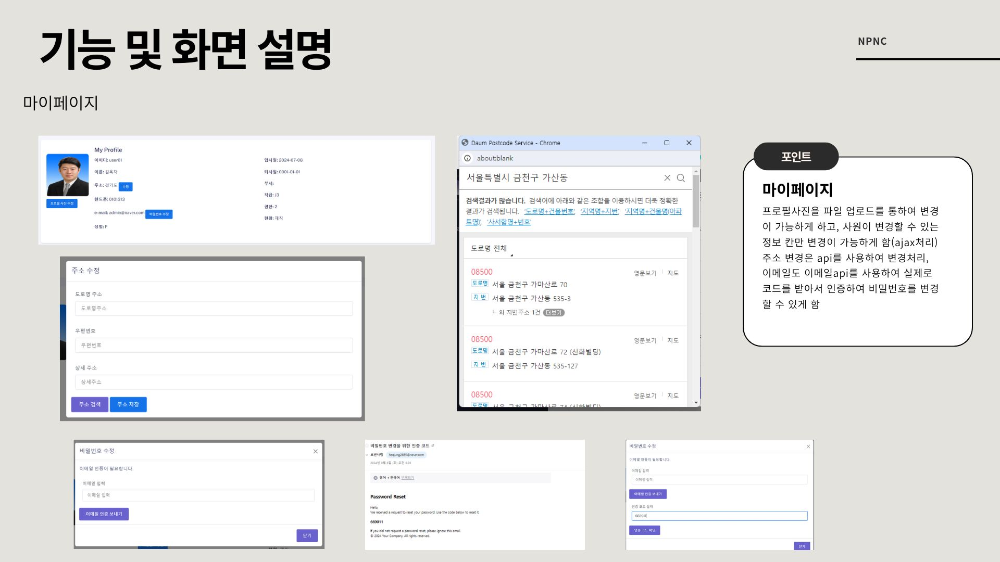
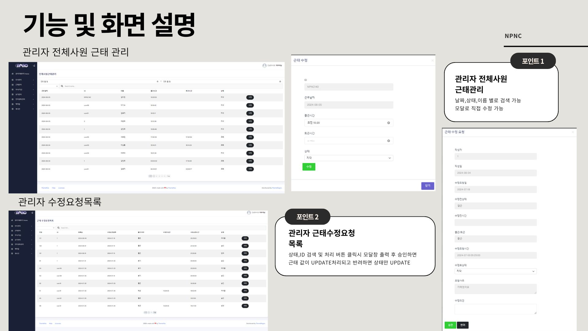
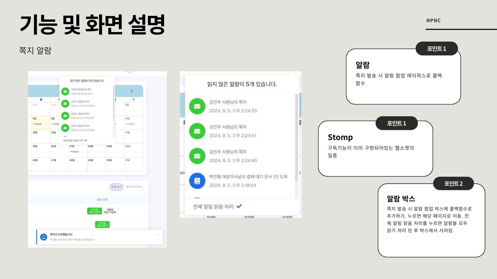

# NPNC(범기업용 그룹웨어)

* 다양한 기관들이 범용적으로 사용할 수 있는 그룹웨어 웹어플리케이션
* 클라우드 활용 자바개발자 양성과정 팀 프로젝트 우수상 수상

## 프로젝트 개요

문서 관리 및 결재를 전자로 처리할 수 있는 다양한 기관들이 범용적으로 사용할 수 있도록 하기 위한 웹어플리케이션을 제작하고자 하였다. 결재 라인의 승인 처리에 따라 문서 파일에도 결재 내용이 업데이트 되며 오프라인에서 활용이 가능하도록 파일로 다운로드를 받을 수 있도록 하여 온오프라인에서 모두 활용하기 좋은 서비스를 제공하고자 하였다.

- 클라우드 활용 자바개발자 양성과정 공통 파이널 프로젝트
- 개발기간: 2024-06-19 ~ 2024-08-06
- 개발인원: 총 6명

팀명 : NPNC(NoPainNoCode)

| 팀장 | 팀원 | 팀원 | 팀원 | 팀원 | 팀원 |
| --- | --- | --- | --- | --- | --- |
| [박진형](https://github.com/JinHyung-dev) | [김혜정](https://github.com/kimhyejeongd) | [서보민](https://github.com/hiusbm01) | [이기수](https://github.com/Kisoo123) | [이성록](https://github.com/evergreen93) | [이우석](https://github.com/lws9) |

## 목적 및 기대효과

- 온오프라인에서 모두 활용/관리가 가능한 전자 결재 서비스 제공
- 사내/팀별 캘린더를 통한 일정 공유 기능 제공
- 사내 쪽지, 채팅, 게시판을 통한 의사소통 기능 제공
- 메인화면의 다양한 위젯으로 각 기능에 대한 빠른 접근성 제공
- 웹 내 알림 팝업을 통해 문서 결재 현황, 채팅 및 쪽지 수신에 대한 정보를 빠르게 제공

사내 업무를 위해 필요한 기능들을 제공하여 다양한 기업 재직자들에게 업무 효율 향상에 기여하고자 하였다.

## 개발 환경 및 사용 기술
#### 개발 환경

#### 데이터베이스 
   
#### 서버

#### 개발 언어

#### 사용 기술

-009688?style=flat-square)

#### API

#### 도구

## ERD

## 와이어프레임 & 디자인

## 프로젝트 기능

